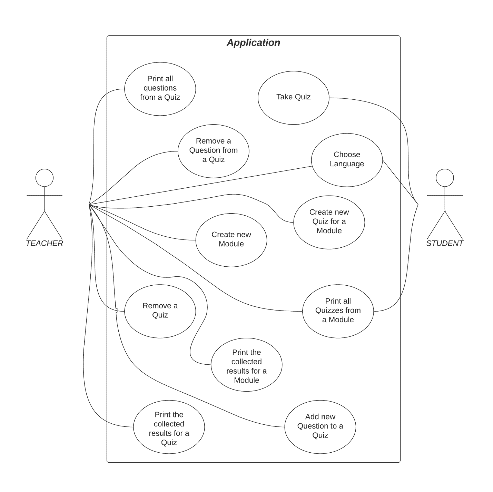
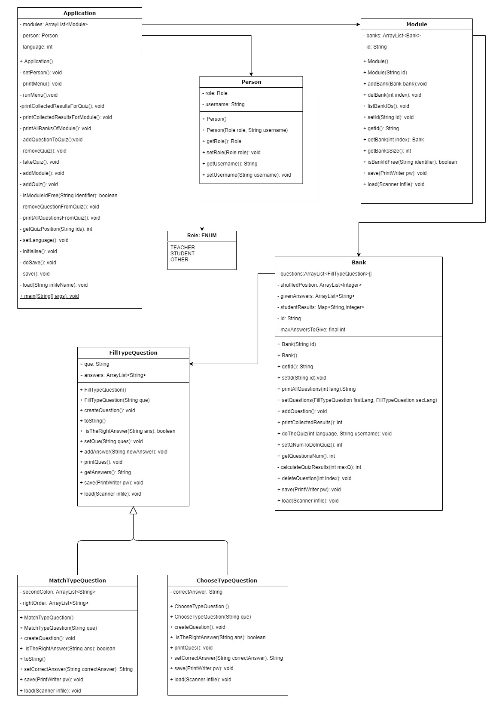

# Question Bank Management System


## Project Overview

The Question Bank Management System is a Java-based application designed to help teachers create quizzes for various modules and allow students to take these quizzes and view their results. This project demonstrates a comprehensive application of object-oriented programming principles, including inheritance, encapsulation, and polymorphism. The system handles operations such as adding, removing, and listing questions, as well as taking and evaluating quizzes.

## Features

- **Question Class Hierarchy**: Utilizes inheritance to create a base `FillTypeQuestion` class and extends it to `ChooseTypeQuestion` and `MatchTypeQuestion` classes.
- **Module and Bank Management**: Efficient storage and retrieval of questions within modules using `ArrayList`.
- **Custom Methods**: Implementation of specialized methods for data persistence and representation.
- **Exception Handling**: Robust error handling to manage user inputs.
- **Testing and Validation**: Extensive testing to ensure all functionalities work as expected, covering a variety of test cases.

## Project Structure

```plaintext
├── src
│   ├── Application.java
│   ├── Bank.java
│   ├── ChooseTypeQuestion.java
│   ├── FillTypeQuestion.java
│   ├── MatchTypeQuestion.java
│   ├── Module.java
│   ├── Person.java
│   ├── Role.java
│   └── README.md
```

### Application.java
Manages the main logic and user interaction of the application.

### Bank.java
Manages collections of questions within a module.

### ChooseTypeQuestion.java
Extends `FillTypeQuestion` to handle multiple choice questions.

### FillTypeQuestion.java
Base class for all question types.

### MatchTypeQuestion.java
Extends `FillTypeQuestion` to handle matching questions.

### Module.java
Represents a module containing multiple question banks.

### Person.java
Represents a user with a role in the system.

### Role.java
Enumerates different roles users can have within the system.

## Key Highlights

### Object-Oriented Design
- **Inheritance**: Abstract class `FillTypeQuestion` is inherited by `ChooseTypeQuestion` and `MatchTypeQuestion`, demonstrating code reuse and polymorphism.
- **Encapsulation**: Private variables with public getter and setter methods ensure data hiding and encapsulation.

### Data Structures
- **ArrayList Usage**: Efficient management of questions and modules using dynamic arrays.

### Exception Handling
- **Robust Input Validation**: Ensures that the application handles incorrect inputs gracefully, maintaining the integrity of the program.

## Installation

To run this project, you need to have Java installed on your system. Clone the repository and compile the Java files:

```bash
git clone https://github.com/yourusername/question-bank-management-system.git
cd question-bank-management-system/src
javac *.java
```

Run the application:

```bash
java Application
```

## Usage

The Question Bank Management System allows you to:

- **Add a Question**: Add new questions to a bank with specific attributes.
- **Remove a Question**: Remove questions from a bank based on their unique ID.
- **List Questions**: Display a list of all questions within a bank.
- **Take a Quiz**: Students can take quizzes and view their results.

## Testing

Extensive testing was conducted to ensure the reliability and accuracy of the system. Key test cases include:

- Adding multiple questions and ensuring they are correctly stored.
- Removing questions and verifying the integrity of the remaining list.
- Handling erroneous inputs gracefully and maintaining program stability.

## Diagrams

### Use Case Diagram


### Class Diagram



## Contributions

Contributions are welcome! Please fork the repository and submit pull requests with your improvements.

## Author

Nikola Nikolov [nin6]  
Email: [Nin6@aber.ac.uk](mailto:Nin6@aber.ac.uk)

## License

This project is licensed under the MIT License - see the [LICENSE](LICENSE) file for details.
